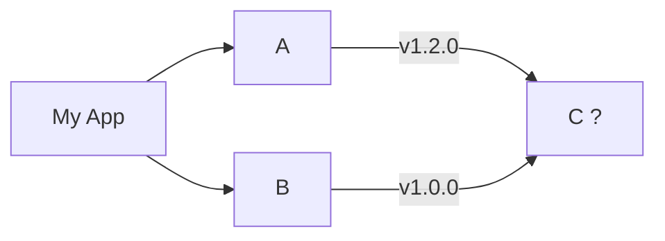
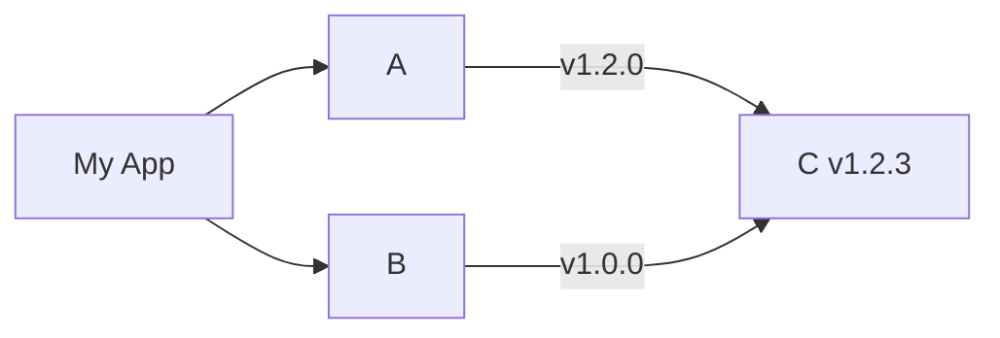
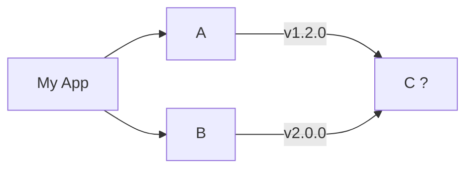
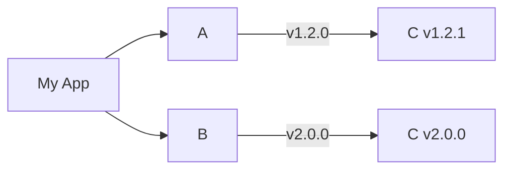

<!-- -->

---
background: https://source.unsplash.com/1600x900/?rust
layout: cover
---

# Build trust with rust

---
layout: center
---


> **Jonathan Cornaz**
> 
> Senior software developer at Optravis


<v-clicks>

Rust for hobby projects since 2020

<p><logos-github-icon/> jcornaz </p>

</v-clicks>

<!--
## Optravis
* We have a booth
* Quiz!
-->

---

## <logos-rust/>

> A language empowering **everyone** to build **reliable** and **efficient** software.

<v-clicks>

* Performance
  * Compiled to machine code
  * No garbage collector
* Reliability
  * Strong type system
  * Memory safe
* Productivity
  * Type inference
  * Excellent tooling

</v-clicks>


<!--
TIME: 45m

* Pick two
* No runtime/virtual machine
* High level abstractions
* But complex and hard to learn
-->

---

## Hello world

```rust
fn main() {
  println!("Hello world!");
}
```

<!-- 
Println! is a macro
-->

---

## Structs and enums

```rust {1-4|6-9|all}
struct Vector {
  x: i32,
  y: i32,
}

enum State {
  Idle,
  Moving { velocity: Vector },
}

struct Person {
  location: Vector,
  state: State,
}
```

<!--
* enums are like sealed classes in kotlin
* Zero cost abstraction
-->

---

## Methods

```rust {1-4|6,14|7-9|11-13|all}
struct Vector {
  x: i32,
  y: i32,
}

impl Vector {
  fn dot(self, other: Vector) -> i32 {
    self.x * other.x + self.y * other.y
  }

  fn new(x: i32, y: i32) -> Vector {
    Vector { x, y }
  }
}
```

<v-click>

```rust
let v1 = Vector::new(1, 2);
let v2 = Vector::new(3, 4);
let dot = v1.dot(v2);
```

</v-click>

<!--
* no inheritance
* static dispatch
-->

---

## Traits

```rust {1-4|6-13|all}
trait Len {
  fn new_empty() -> Self;
  fn len(&self) -> usize;
}

impl Len for String {
  fn new_empty() -> Self {
    String::new()
  }
  fn len(&self) -> usize {
    self.len()
  }
}
```

<!--
* Can define 'static' method available on type
* Can refer to the implementation type via `Self`.
* Can be implemented on third party types!
-->

---

## Generics

```rust
fn greet<T : Display>(name: T) {
  let name_string = name.to_string();
  println!("Hello {name_string}!");
}
```

<v-click>

```rust {1|2|3|all}
greet(String::from("hello")); // greet_String(name: String)
greet(3);                     // greet_i32(name: i32)
greet(true);                  // greet_bool(name: bool)
```

</v-click>

<!--
* static dispatch
* no auto-boxing
* each variant can be optimized independently
* bloat, and `dyn` keyword
-->

---

## Iterators

```rust
fn main() {
  (0..100)
    .filter(|n| *n % 2 == 0)
    .map(|n| n + 1)
    .map(|i| i.to_string())
    .for_each(|v| {
        println!("{v}");
    })
}
```

<!--
* zero cost abstractions
* readable idiomatic code is fast
-->

---

## Macros

<v-click>

```rust {1-2|4-7|all}
#[derive(Serialize, Deserialize)]
struct Person { name: String }

fn main() {
  let name = "BaselOne";
  println!("Hello {name}");
}
```

</v-click>

<!--
TIME: 25m
* No support for reflection 
* Macros can read and generate code at compile time
-->

---

## Memory ownership model

<v-clicks>

* Ownership (example: `String`)
  * Each value as exactly one owner
  * When the owner's scope ends, the memory is free
* Read only borrow (example: `&String`)
  * There is an owner (the memory is not yet free)
  * There may be concurrent read-only borrows
* Mutable borrow (example: `&mut String`)
  * There is an owner (the memory is not yet free)
  * There is no concurrent borrow

</v-clicks>

<!--
* no use after free
* no double free
* no dangling pointer
* no data race
* hard to create a memory leak
-->

---

## Automatic free

```rust {1,3|2|3}
fn foo() {
  let s1 = String::from("hello");
}
```

<!--
Enforced at compile time
-->

---

## Move semantic

<v-click>

```rust {1|1-4|7|1,2,3,4,8|9}
fn foo(s: String) -> String { 
  println!("{s}");
  s
}

fn main() {
  let s1 = String::from("hello world");
  let s2 = foo(s1);
}
```

</v-click>

<!--
Ownership can be transfered via:
* Function argument
* Return value
-->

---

## Use after free

```rust {1|4|5|6|all}
fn drop<T>(s: T) {}

fn main() {
  let s = String::new();
  drop(s);
  println!("{s}");
}
```

<v-click>


</v-click>

<!--
"double free" is also prevented the same way, as it is a special case of "use after free"
-->

---

## References

```rust {1-6|8-13|all}
fn take_mutable_ref(s: &mut String) {
  // The reference is guarandeed to live for at least as long as the scope
  println!("{s}");
  // This scope has exclusive access to the reference
  s.push_str("!");
}

fn take_read_only_ref(s: &String) {
  // The reference is guarandeed to live for at least as long as the scope
  println!("{s}");
  // There may be other scopes with concurrent access
  s.push_str("!"); // <-- Compile error
}
```

<!--

TIME: 20m

-->

---
layout: center
---

## Fearless concurrency demo

<!--
TIME: 10m
-->

---

## The billion dollar mistake?

<v-click>

```rust
enum Option<T> {
  Some(T),
  None,
}
```

</v-click>

<v-click>

```rust
let x: Option<i32> = None;
match x {
  Some(v) => println!("There is something: {v}"),
  None => println!("There is nothing"),
}
```

</v-click>

<!--
- Quote by Tony Hoare

-->

---

## Errors

<v-clicks>

* Unrecoverable *panic*
* Recoverable *error*

</v-clicks>

---

## Panic

```rust
let array = [0, 1, 2];
let option: Option<&i32> = array.get(5); // None
let value: &i32 = array[5]; // Panic!
```

<!--
A panic, is an immediate crash of the software with a stack trace
It cannot be recovered
-->

---

## Result

```rust
enum Result<T, E> {
  Ok(T),
  Err(E),
}
```

<v-click>

```rust {1|3-5}
struct MyError;

fn may_fail() -> Result<i32, MyError> {
  Err(MyError)
}
```

</v-click>

<!--
We have to handle the error
-->

---

## Result

```rust
let result = may_fail()
match result {
  Ok(v) => println!("The value is: {v}"),
  Err(err) => println!("Oops, there was an error: {err}"),
}
```

<v-click>

```rust
fn foo() -> Result<String, MyError> {
  let v: i32 = may_fail()?;
  Ok(format!("{v}"))
}
```

</v-click>

<!--
There is a syntax sugar
-->

---
layout: center
---


---

## Tooling

<v-clicks>

* Toolchain manager (`rustup`)
* Package manager (`cargo`)
* Linter (`cargo clippy`)
* Code formater (`cargo fmt`)
* Documentation generator (`cargo doc`)
* Your favorite IDE
  * IntelliJ, CLion
  * Any LSP compatible editor (VSCode, vim, helix, etc.)
  
</v-clicks>

---

## A good fit for:

<v-clicks>

* Performance critical workloads
* CLI applications
* Backend services
* System programing
* Game developement

</v-clicks>

<!--
* Fast
* Reliable
* Excellent tooling
-->

---
layout: center
---


* [rust-lang.org/learn](https://www.rust-lang.org/learn)
  * The rust book
  * Rustlings

<!-- Learn -->

---
layout: center
---

## Questions

---
layout: center
---

## Thank you

---
layout: cover
background: ./sponsors.png
---

<!-- -->

---

## Dependency management



---

## Dependency management



---

## Dependency management



---

## Dependency management


